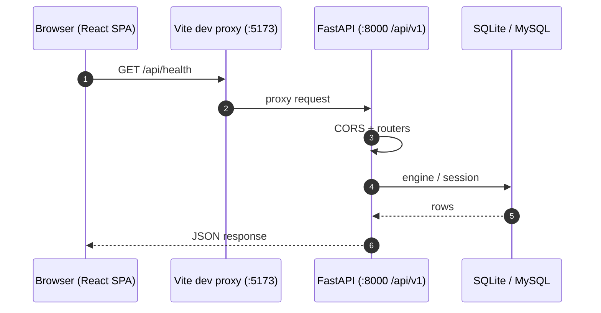
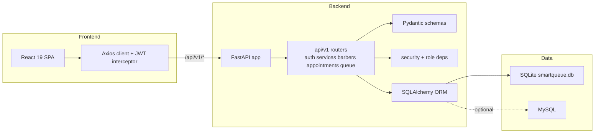
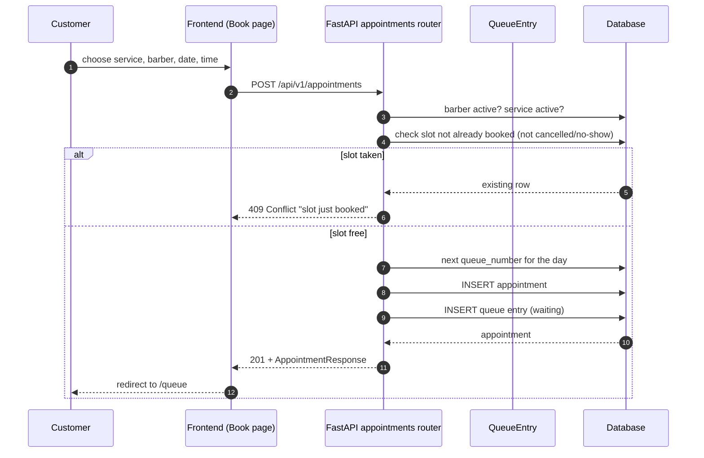
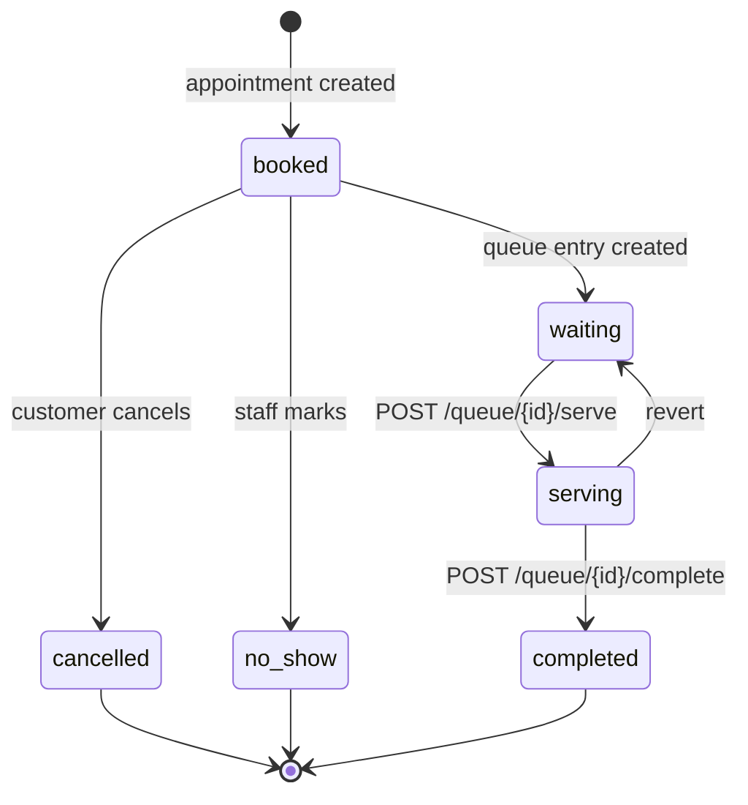
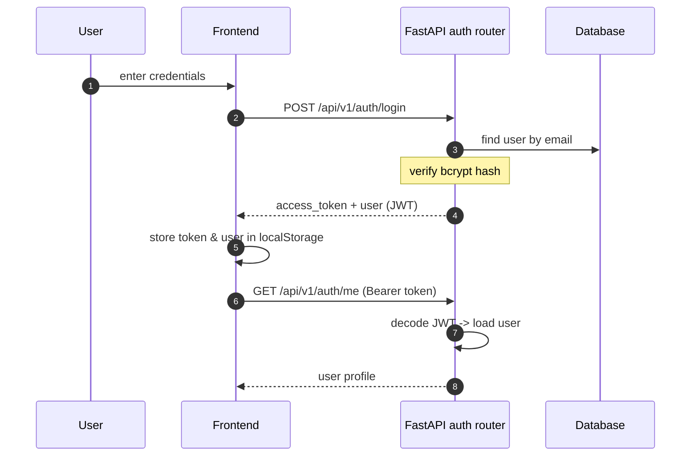

# SmartQueue — Diagrams

This folder contains the rendered diagrams (PNG), their editable sources (`.drawio` / `.dbml`), and the Mermaid sources below as text fallbacks. Open the `.drawio` files in <https://app.diagrams.net> and the `.dbml` file in <https://dbdiagram.io>.

| Diagram | PNG | Editable source |
| --- | --- | --- |
| System architecture | [SmartQueueArchi.png](./SmartQueueArchi.png) | [SmartQueueArchi.drawio](./SmartQueueArchi.drawio) |
| Entity Relationship | [SmartQueueER.png](./SmartQueueER.png) | [SmartQueueER.dbml](./SmartQueueER.dbml) |
| UML class diagram | [SmartQueueClassDia.png](./SmartQueueClassDia.png) | [SmartQueueClassDia.drawio](./SmartQueueClassDia.drawio) |

The Mermaid sources below render the same content at https://mermaid.live or in any Mermaid-capable viewer.

---

## 1. System architecture





---

## 2. Entity Relationship Diagram (ERD)

```mermaid
erDiagram
    users {
        int id PK
        string name
        string email UK
        string password_hash
        string phone
        string role
        datetime created_at
    }
    barbers {
        int id PK
        string name
        string specialization
        string phone
        string status
        datetime created_at
    }
    services {
        int id PK
        string name
        string description
        int duration
        numeric price
        string status
        datetime created_at
    }
    appointments {
        int id PK
        int user_id FK
        int barber_id FK
        int service_id FK
        date appointment_date
        time appointment_time
        string status
        int queue_number
        datetime created_at
        datetime updated_at
        unique (barber_id, appointment_date, appointment_time)
    }
    queue {
        int id PK
        int appointment_id FK, UK
        int queue_number
        int estimated_wait_time
        string status
        datetime created_at
        datetime updated_at
    }

    users ||--o{ appointments : books
    barbers ||--o{ appointments : serves
    services ||--o{ appointments : provides
    appointments ||--o| queue : has
```

---

## 3. Booking flow



---

## 4. Queue lifecycle (admin view)



---

## 5. Auth flow

