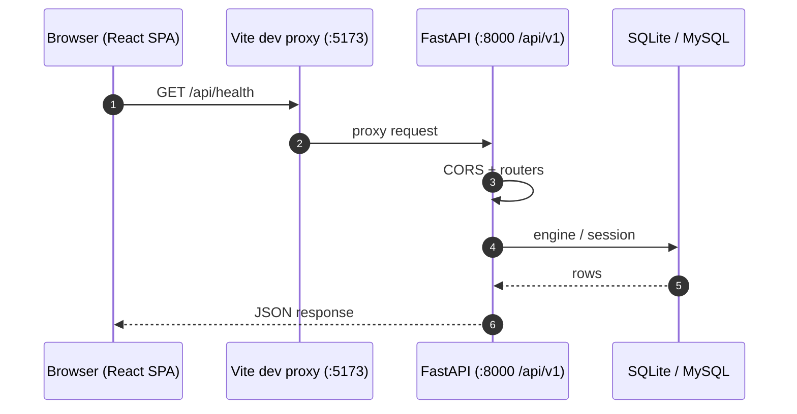
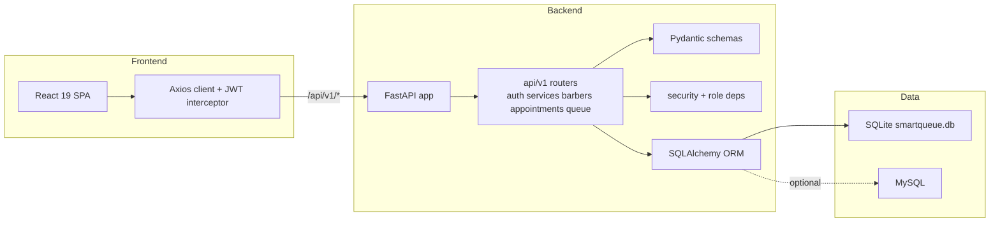
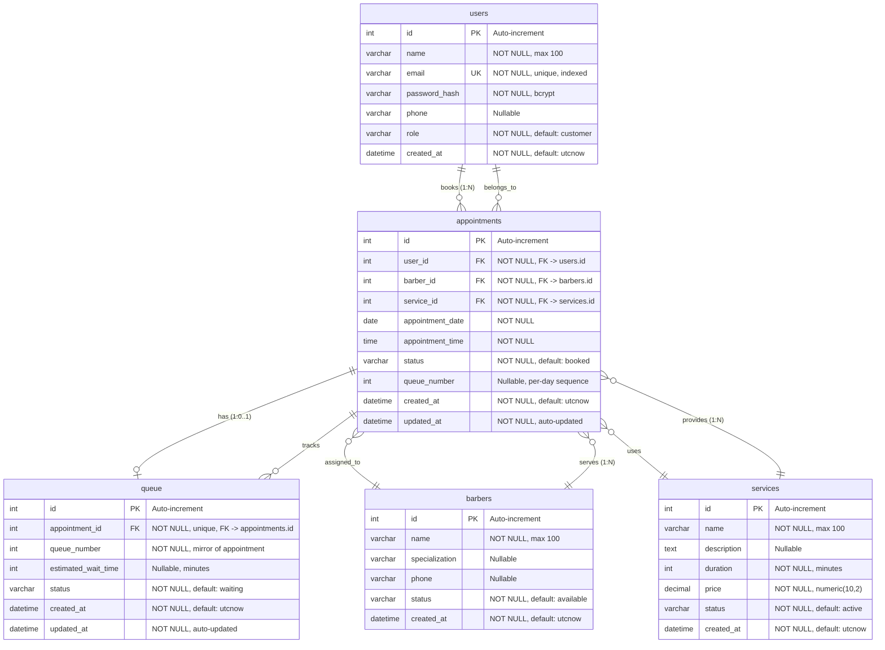
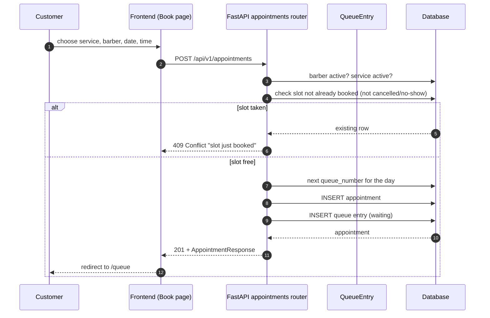
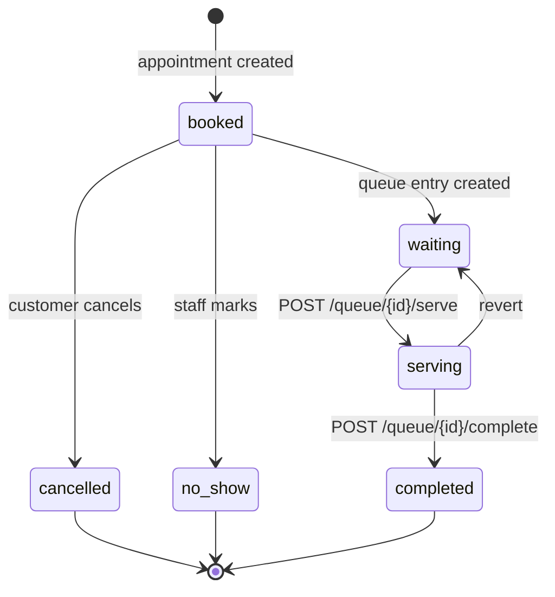
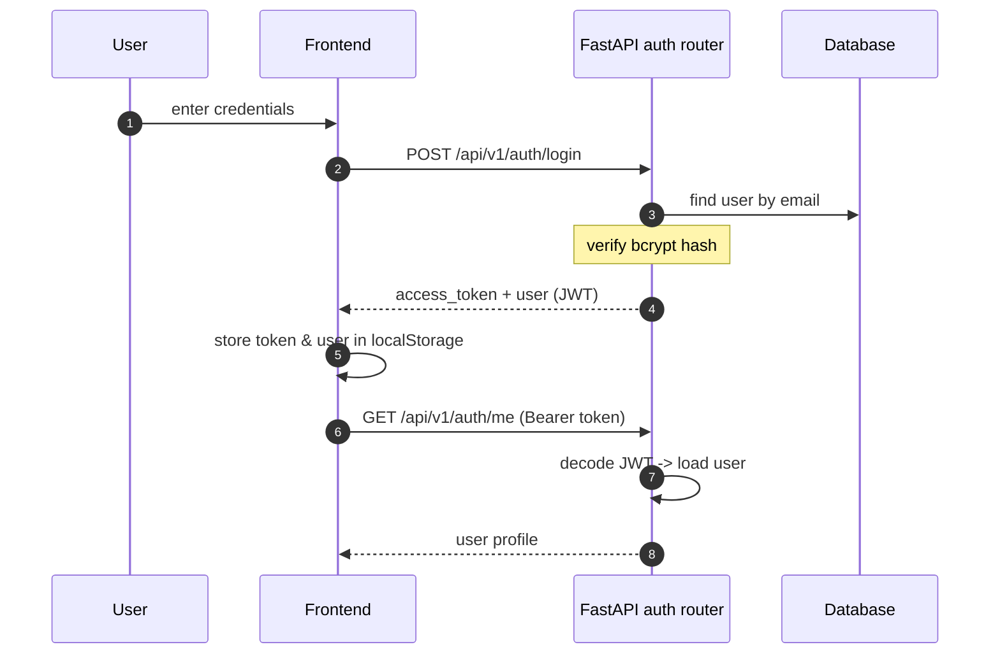

# SmartQueue — Diagrams

This folder contains the rendered diagrams (PNG), their editable sources (`.drawio` / `.dbml` / `.mmd`), and the Mermaid sources below as text fallbacks. Open the `.drawio` files in <https://app.diagrams.net>, the `.dbml` file in <https://dbdiagram.io>, and the `.mmd` file at <https://mermaid.live>.

| Diagram | PNG | Editable source |
| --- | --- | --- |
| System architecture | [SmartQueueArchi.png](./SmartQueueArchi.png) | [SmartQueueArchi.drawio](./SmartQueueArchi.drawio) |
| Entity Relationship | [SmartQueueER.png](./SmartQueueER.png) | [SmartQueueER.dbml](./SmartQueueER.dbml), [SmartQueueER.mmd](./SmartQueueER.mmd) |
| UML class diagram | [SmartQueueClassDia.png](./SmartQueueClassDia.png) | [SmartQueueClassDia.drawio](./SmartQueueClassDia.drawio) |

The Mermaid sources below render the same content at https://mermaid.live or in any Mermaid-capable viewer.

---

## 1. System architecture

---

## 2. Entity Relationship Diagram (ERD)

The ER diagram visualizes the 5-table schema. `appointments` is the central entity linking customers, barbers, and services, while `queue` provides 1:1 live queue tracking per appointment.

### Table Summary

| Table | Columns | PK | FKs | Unique Constraints |
| --- | --- | --- | --- | --- |
| `users` | id, name, email, password_hash, phone, role, created_at | id | — | email |
| `barbers` | id, name, specialization, phone, status, created_at | id | — | — |
| `services` | id, name, description, duration, price, status, created_at | id | — | — |
| `appointments` | id, user_id, barber_id, service_id, appointment_date, appointment_time, status, queue_number, created_at, updated_at | id | user_id→users, barber_id→barbers, service_id→services | (barber_id, appointment_date, appointment_time) |
| `queue` | id, appointment_id, queue_number, estimated_wait_time, status, created_at, updated_at | id | appointment_id→appointments | appointment_id |

### Foreign Key Relationships

| Parent | Child | FK Column | On Delete |
| --- | --- | --- | --- |
| `users` | `appointments` | `user_id` | CASCADE |
| `barbers` | `appointments` | `barber_id` | CASCADE |
| `services` | `appointments` | `service_id` | CASCADE |
| `appointments` | `queue` | `appointment_id` | CASCADE |

### Status Enums

| Table | Column | Allowed Values |
| --- | --- | --- |
| `users` | `role` | customer, admin, staff |
| `barbers` | `status` | available, busy, inactive |
| `services` | `status` | active, inactive |
| `appointments` | `status` | booked, waiting, serving, completed, cancelled, no_show |
| `queue` | `status` | waiting, serving, completed |

---

## 3. Booking flow

---

## 4. Queue lifecycle (admin view)

---

## 5. Auth flow

